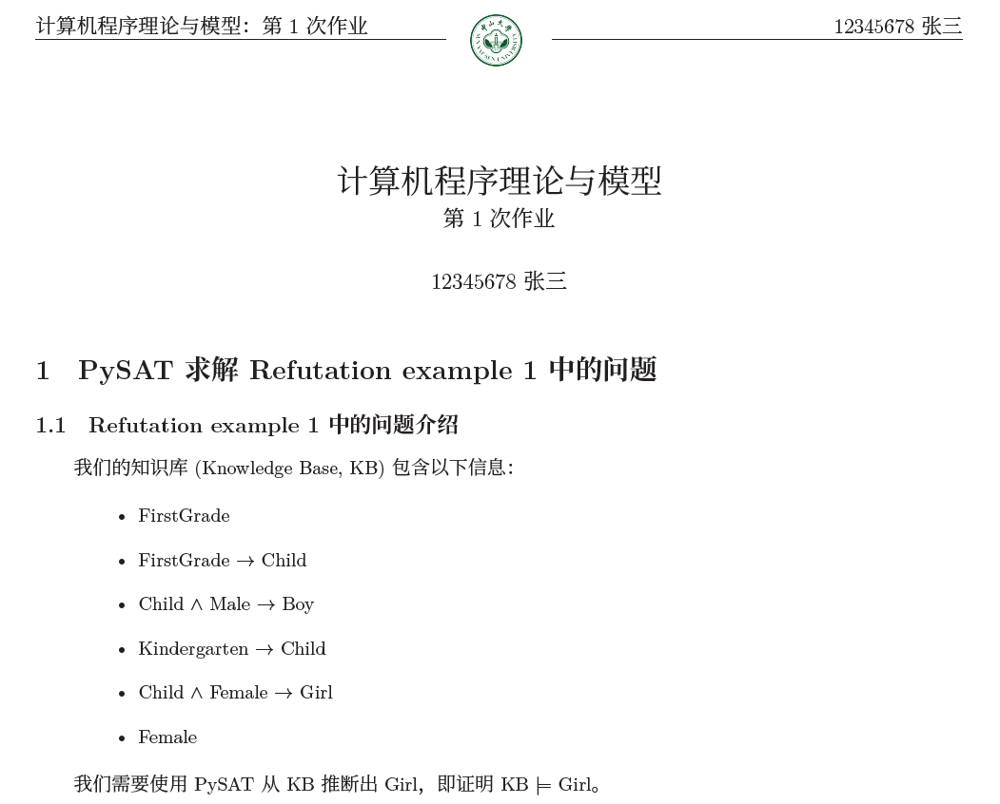

# 项目说明

本项目可用于学校作业的实验报告撰写，该项目并不只针对中山大学，只需要更换 `logo` 下的图片，并在 `main.tex` 的位置上更换对应的图片的名称即可，更换位置为如下：

```
\raisebox{-5mm}{
    \quad % 空格
    \includegraphics[height=10mm]{logo/sysu_logo.png} 
    \quad
}
\hrulefill
```

# 效果展示



# 变量说明

修改变量区域中的变量即可调整报告的相关信息，如作者名，学号，报告标题，报告副标题。

```
\newcommand{\titleText}{计算机程序理论与模型}
\newcommand{\subTitleText}{第 1 次作业}
\newcommand{\authorID}{12345678}
\newcommand{\authorName}{张三}
```